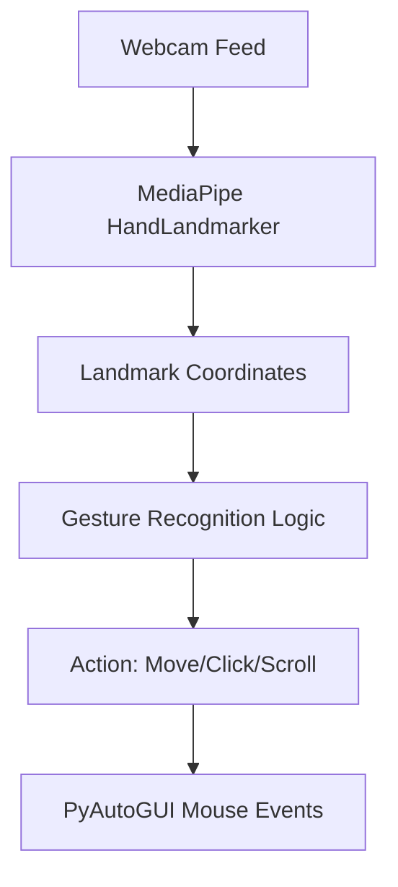

# AI Virtual Mouse: Student Learning Manual

This manual explains the inner workings of the AI Virtual Mouse project, designed to help students understand computer vision, hand tracking, and system-level automation.

---

## 1. System Architecture

The project consists of three main components:
1.  **Hand Tracking Engine**: Uses MediaPipe to detect 21 landmarks on a hand.
2.  **Gesture Logic**: Interprets the landmarks to identify specific actions (Click, Move, Scroll).
3.  **Mouse Controller**: Maps camera coordinates to screen resolution and performs OS-level actions.



---

## 2. Hand Tracking (MediaPipe Tasks API)

We use the latest **MediaPipe Tasks API** for high-performance landmark detection. The `HandLandmarker` model identifies 21 points on the hand.

### Key Code Snippet:
```python
# Initialize the detector
base_options = python.BaseOptions(model_asset_path='hand_landmarker.task')
options = vision.HandLandmarkerOptions(
    base_options=base_options,
    running_mode=vision.RunningMode.IMAGE,
    num_hands=1
)
detector = vision.HandLandmarker.create_from_options(options)

# Process a frame
mp_image = mp.Image(image_format=mp.ImageFormat.SRGB, data=cv2_img_rgb)
results = detector.detect(mp_image)
```

---

## 3. Gesture Recognition Logic

Gestures are detected based on the **distance** between landmarks or the **state** of fingers (UP vs DOWN).

### Current Gesture Rules (V4 — Final):
- **Move Cursor**: Pinch Index (8) & Thumb (4) — hold and move hand.
- **Left Click**: Quick tap Index (8) & Thumb (4) — pinch and release without moving.
- **Right Click**: Touch Thumb (4) & Middle (12) tips together.
- **Scroll**: Touch Thumb (4) & Pinky (20) — move hand up/down to scroll.
- **Drag & Drop**: Close all fingers into a fist — hold to drag, open to drop.

### Calculating Distance:
```python
def get_distance(p1, p2, lm_list):
    x1, y1 = lm_list[p1][1], lm_list[p1][2]
    x2, y2 = lm_list[p2][1], lm_list[p2][2]
    return math.sqrt((x2 - x1)**2 + (y2 - y1)**2)
```

---

## 4. Mouse Control & Smoothing

To prevent the cursor from "shaking" (jitter), we use a **Smoothing Algorithm**. Instead of moving directly to a point, we calculate a weighted average of the current and previous positions.

### State-Based Drag & Drop:
Unlike simple clicks, dragging requires the mouse button to be held down while moving. We use a state-based approach:
1. **`start_drag()`**: Sends `mouseDown`.
2. **`move()`**: Updates position while the button is down.
3. **`end_drag()`**: Sends `mouseUp` when the gesture is released.

---

## 5. Improved Vision Understanding

Reliability is achieved through two key systems:
- **Closest-Finger-Wins**: Instead of checking each gesture independently, the engine calculates the distance from thumb to every finger and picks the CLOSEST one. This guarantees only ONE gesture fires at a time.
- **State Machine for Move vs Click**: A timer + movement tracker in `main.py` differentiates a "hold and move" (MOVE) from a "quick tap" (LEFT_CLICK) on the same Index+Thumb pinch gesture.
- **Fist Priority**: The DRAG gesture (all fingers down) is always checked first before any pinch detection.

---

## 5. Web Dashboard (React + FastAPI)

For a premium experience, the project includes a real-time settings dashboard.
- **FastAPI Backend**: Runs in a separate thread to handle settings updates via WebSockets.
- **React Frontend**: Built with **TailwindCSS V4** for a modern look.

---

## 6. How to Extend This Project

- **Multi-Hand Support**: Modify `num_hands=2` in `HandLandmarkerOptions`.
- **Custom Gestures**: Add checks for the Ring finger or palm orientation.
- **ML Training**: Use the coordinates to train a Scikit-Learn model for more complex gesture classification.

---
*Happy Coding!*
